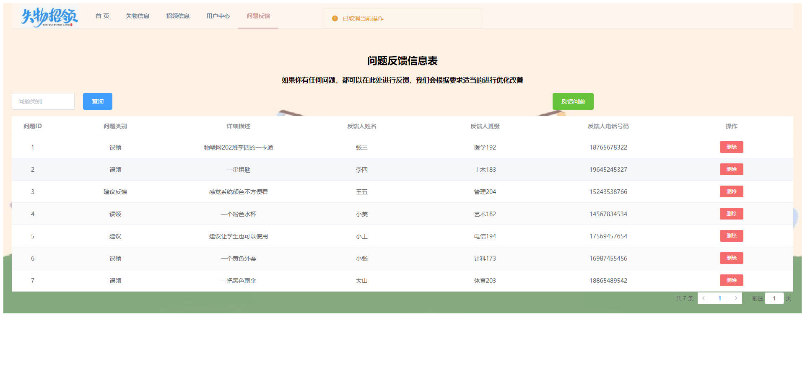
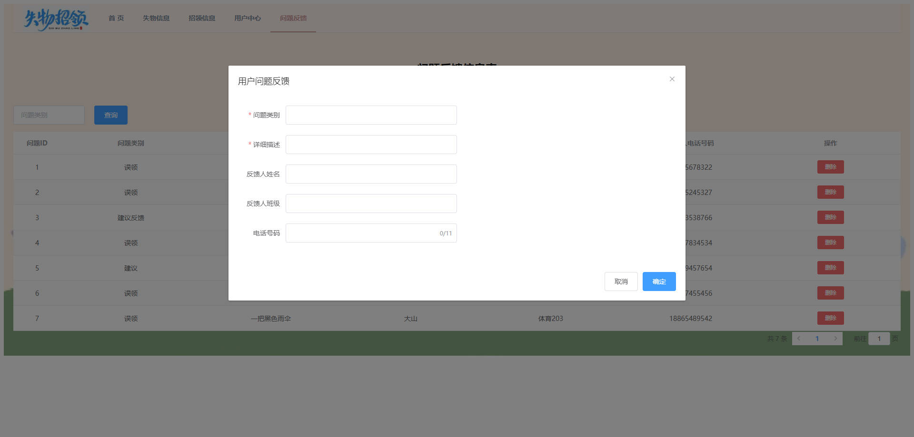

# 基于Springboot的失物招领管理系统

# Springboot-060

### 技术栈

Springboot mybatis vue

## 数据库

mysql (4张表)


## 功能描述

~~~properties
管理员
注册、登录
失物信息查询、发布、编辑、删除
招领信息查询、编辑、删除
用户信息查询、新增、修改、删除
~~~


## 运行截图

### 前台







### 后台


## 访问网址

### 前台

```
http://localhost:8080

账号 123
密码 123
```

### 后台

```

```


### 


##  技术交流或打赏


